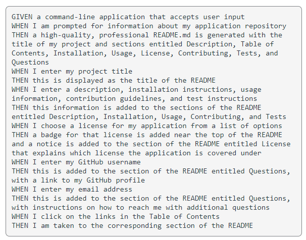

# README Generator
  For Challange 9, we had to create a README generator.

  [See deployed version here.]({$dat,url})

  ---

  ## Content:
  
1. [About](#about)

    1. [User Story](#user%story)
    2. [Acceptance criteria](#acceptance%20criteria)
    3. [Visuals](#visuals)
    4. [Build](#build)
2. [Installation](#installtion)   
3. [License](#license) 
4. [Contibuting](#contribution)
5. [Test](#test)
6. [Authors and Acknowlegement](#authors%20and%20acknowlegemnt)

---

## About:

  We had to create a README Generator. This makes it mush easier t creat a README file for my work as all the questions are already pre created for each section of the file.

---

## User Story:

---

## Acceptance Criteria:

## Visual:

View demo: https://youtu.be/jNC1lFo7DNw
---

## Installation:

  https://github.com/Mariana21hch/READMEgenerator

    Clone the repo:

      git clone https://github.com/Mariana21hch/READMEgenerator

---

## License

  License for this project - undefined

## Contributing: 

## Test:

  N/A

---

## Authors and Acknowlegements:

 https://drive.google.com/file/d/14-cH3FD4I-N8G_5YSVYspv0AsnqvWZ6-/view

 https://www.youtube.com/watch?v=o8hkjz1TQuQ&ab_channel=MYENGINEERINGHACKS
 

---

## Contact Information:

  GitHub Username: Mariana21hch
  Github Email: mariana21hch@gmail.com